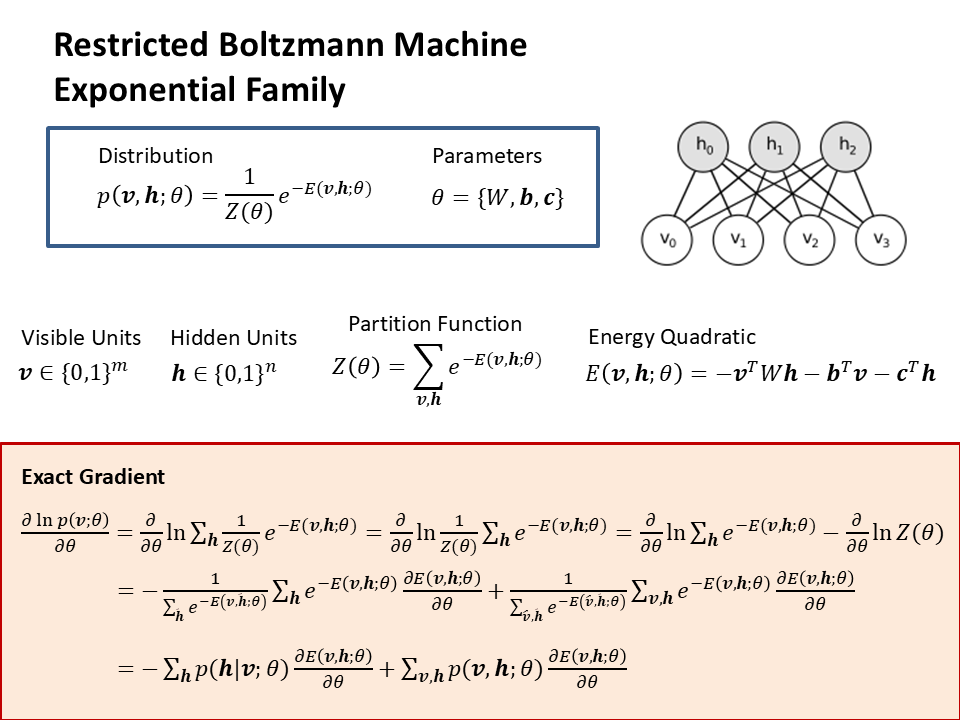
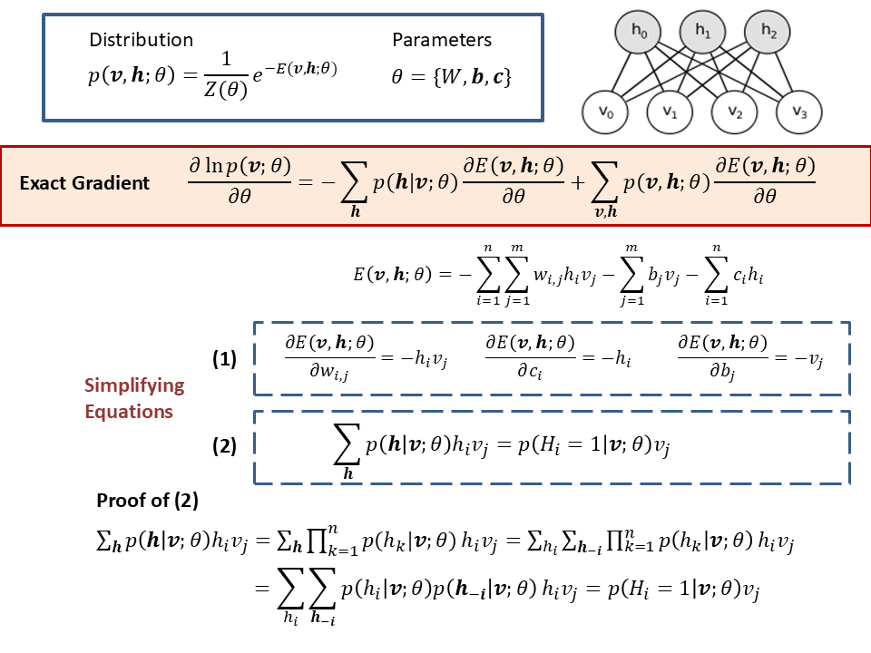
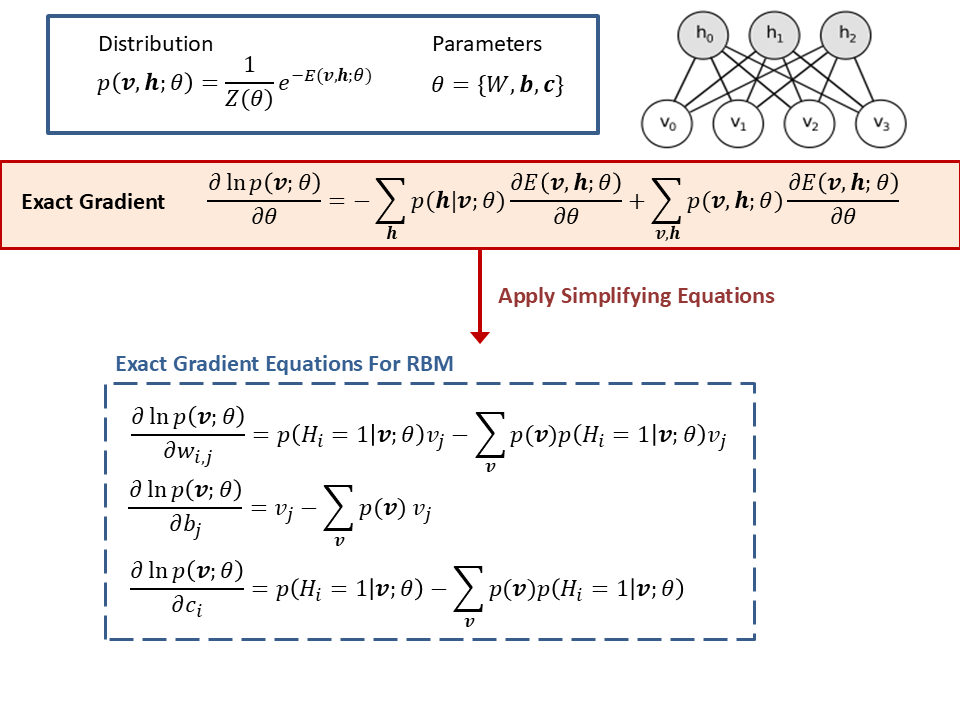
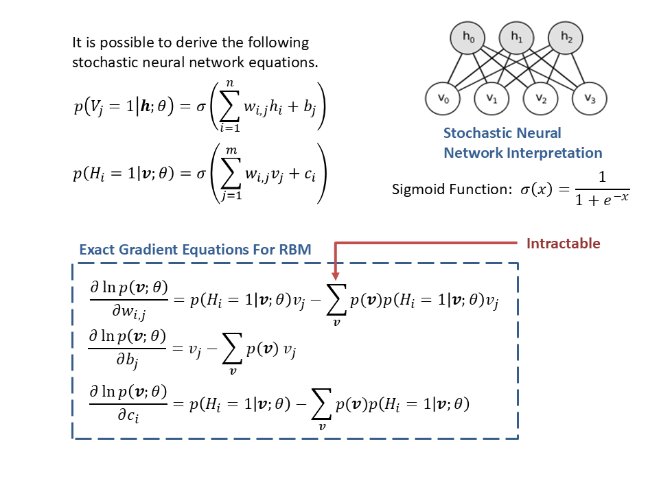
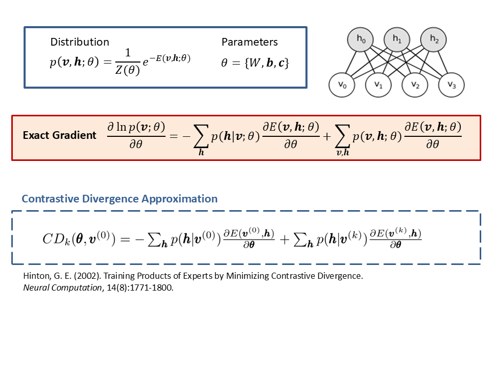
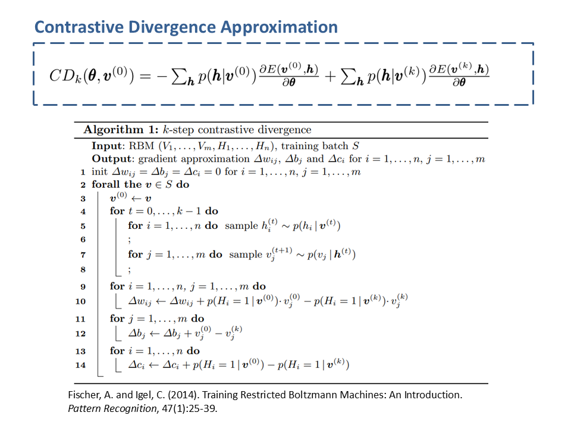
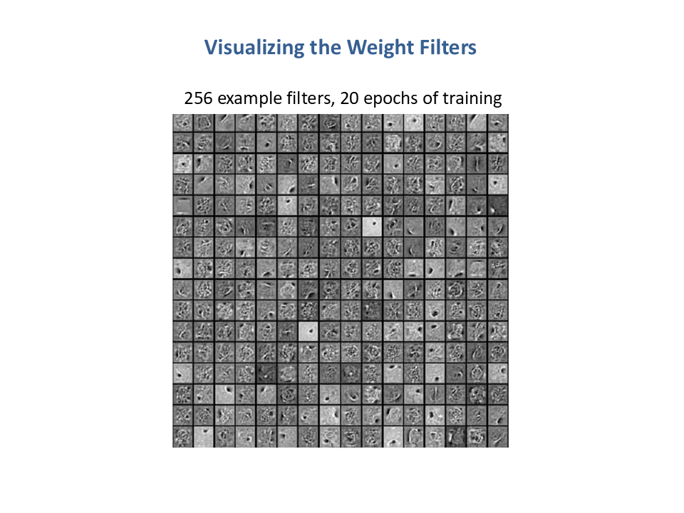
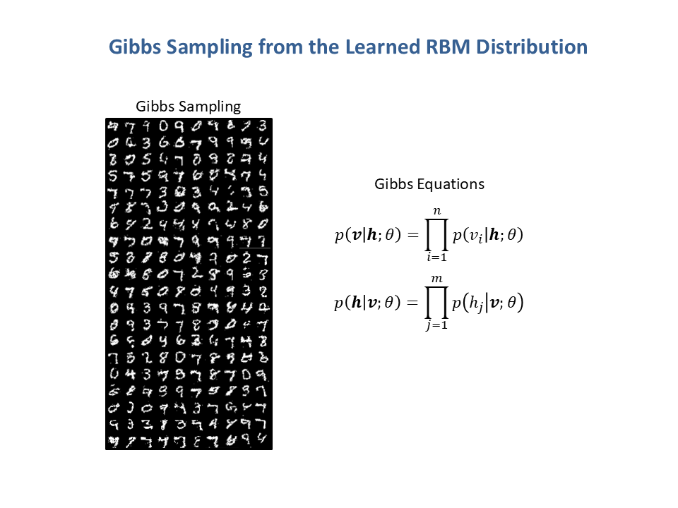

# learning-RBM-generative-model

Code to implement a learning algorithm for a Restricted Boltzmann Machine (RBM) generative model.

The main training loop for the learning algorithm is available in the file: ``` train_RBM.m ```

***



***


***


***


***


***


***


***


